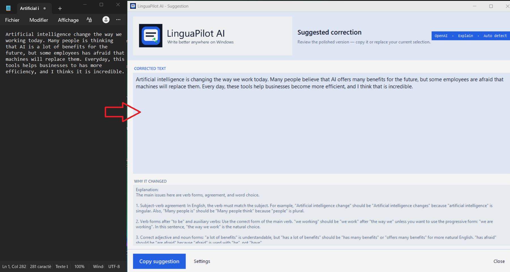

# LinguaPilot AI — User Guide

Official website: https://linguapilot.netlify.app/  
Support email: simdev24@gmail.com

LinguaPilot AI helps you correct, improve, rewrite, translate, and understand selected text from everyday applications (Microsoft Word, WhatsApp, email, browser forms, notes, messages, etc.). Select text, press your shortcut, and get an improved version with explanations in a popup.

---

## 💾 Downloads
Download the latest versions from the **Releases** section on the right:
* 🪟 **Windows:** [LinguaPilotAI-Win_V2.2.zip](https://github.com/dany8383/LinguaPilot-AI/releases/download/v2.1/LinguaPilotAI-Win_V2.1.zip) (Stable)
* 💻 **macOS:** [LinguaPilotAI-macOS_V2.1.zip](https://github.com/dany8383/LinguaPilot-AI/releases/download/v2.1/LinguaPilotAI-macOS_V2.1.zip) (Beta)

---

## 🪟 Windows User Guide (Stable)

### Installation
1. Download `LinguaPilotAI-Win_V2.2.zip` and extract it.
2. Run `LinguaPilotAI_Setup_v2.2.exe`.
3. If Windows SmartScreen appears, click **More info** > **Run anyway**. (The app is 100% safe; this warning occurs because the software is new).

### Quick Start
1. Launch the app and open **Settings**.
2. Select your provider (**Gemini, OpenAI, or Ollama**) and paste your API key if required.
3. Click **Test provider**.
4. Select text in any app and press the default shortcut: `Ctrl + Alt + C`.

---

## 💻 macOS User Guide (Beta)

### Installation & Permissions
1. Download `LinguaPilotAI-macOS_V2.1.zip` and extract it.
2. Drag `LinguaPilot AI.app` into your **Applications** folder. Launch it from there.
3. If blocked by macOS, right-click the app, select **Open**, and confirm.
4. **Mandatory:** Go to `System Settings > Privacy & Security`. Grant **Accessibility** and **Input Monitoring** permissions to `LinguaPilot AI.app`. Quit and reopen the app.

### Quick Start
1. Launch from **Applications**.
2. Configure your provider in **Settings / API**.
3. Select text and press the default shortcut: `Control + Option + Command + L`.

---

## ⚙️ Global Features (Windows & macOS)

### Provider Recommendations
* **Gemini:** Simple, quick setup via Google AI Studio.
* **OpenAI:** Best writing quality and professional consistency.
* **Ollama:** Recommended for local, private AI processing (no cloud tokens).

### License Activation
1. In the app, navigate to the **License** section (or `Settings / API`).
2. Copy your **Machine ID**.
3. Send your purchase email and Machine ID to `simdev24@gmail.com`.
4. Enter the activation key you receive (please allow up to 24 hours).

### System Tray & Startup
* **Tray Menu:** Access settings, license, and stop/start listening from the system tray (Windows) or menu bar (macOS).
* **Auto-start:** Enable "Start automatically" in Settings to keep LinguaPilot available whenever you write.

---

## 📧 Support
When contacting support, please include:
- Your OS version.
- Your selected provider (Gemini, OpenAI, or Ollama).
- A brief description of the issue.

---

*Note: API tokens are used only when you request a correction. Ollama mode runs entirely locally.*
